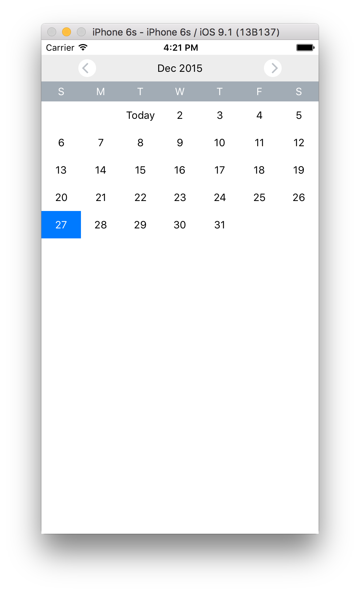

rn-calendars
---

[![NPM version][npm-image]][npm-url]
[![npm download][download-image]][download-url]

[npm-image]: http://img.shields.io/npm/v/rn-calendars.svg?style=flat-square
[npm-url]: http://npmjs.org/package/rn-calendars
[download-image]: https://img.shields.io/npm/dm/rn-calendars.svg?style=flat-square
[download-url]: https://npmjs.org/package/rn-calendars

An extensible calendar component for react-native.

## Install

```
npm i rn-calendars --save
```

## Usage

```js
var React = require('react-native');
var Calendar = require('rn-calendars');

module.exports = React.createClass({
  render () {
    return (<Calendar />);
  }
});
```

## Props

Property  | Description | Type | Default | note
----------|-------------|------|---------|------
startDate | the date of first shown month. | string | new Date() |
headings  | headings of the calendar | array | `['S', 'M', 'T', 'W', 'T', 'F', 'S']` |
renderDay | customize render function of days in the calendar. | func | just render the date |
selectDay | do something after choose one day | func | `console.log(date)` | works only when the `renderDay` function is not customized.
scrollEnabled | could scroll the calendar or not | bool | false |

## Example

View [RNCalendar](RNCalendar).

### ScreenShot



## Acknowledgement

Thanks to [react-native-calendar](https://github.com/christopherdro/react-native-calendar).

## License

The MIT License
